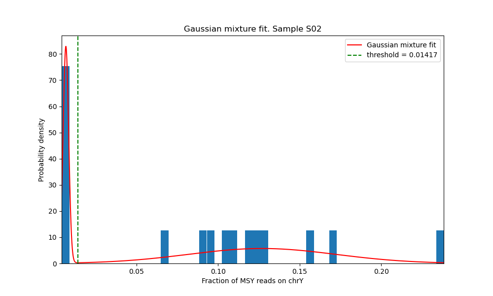

# hoobGender
Fetal gender determination using the male-specific region of the human Y chromosome and unsupervised mixture of gaussians

```python
usage: hoobGender.py [-h] -b BAM -s SAMPLE -f FRACTIONS [-o OUT] [-log LOG]

optional arguments:
  -h, --help            show this help message and exit
  -b BAM, --bam BAM     Path to BAM file
  -s SAMPLE, --sample SAMPLE
                        Sample name
  -f FRACTIONS, --fractions FRACTIONS
                        Path to fractions pickle file
  -e EPSILON, --epsilon EPSILON
                        Epsilon for No Call region
  -o OUT, --out OUT     Output directory
  -log LOG, --log LOG   Provide logging level. Example --log warning',
                        default='info'
```
